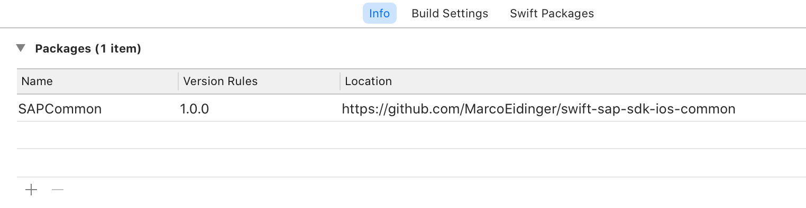
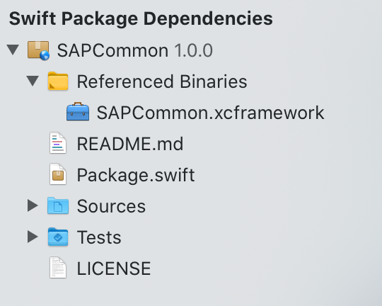

# SAPCommon

This Swift package demonstrates the ability to distribute binary frameworks like `SAPCommon` (or other xcframeworks provided by SAP Cloud Platform SDK for iOS) as Swift packages with the upcoming Xcode 12.

The package can be consumed with Xcode 12 beta

The reference binary `SAPCommon` was compiled locally with Swift version 5.3 (swiftlang-1200.0.16.9 clang-1200.0.22.5). Source code was taken from master branch SAP's internal GitHub repository on June 23, 2020 ~ 1:30pm PST.

## Installation

Add package to your app's target



The resolved package will show as follows



## Usage

```swift 
import SAPCommon
```

Then you can use available [APIs](https://help.sap.com/doc/978e4f6c968c4cc5a30f9d324aa4b1d7/Latest/en-US/Documents/Frameworks/SAPCommon/index.html)

Example for a project with SwiftUI App Life Cycle (can be created with Xcode 12 beta)

```swift
import SwiftUI
import SAPCommon

@main
struct TestApp: App {

    public init() {
        logAppStart()
    }

    func logAppStart() {
        let logger = Logger.shared(named: "AppStart")
        logger.error("Not an error :)")
    }

    var body: some Scene {
        WindowGroup {
            ContentView()
        }
    }
}
```

# Appendix

[WWDC2020: Distribute binary frameworks as Swift packages](https://developer.apple.com/videos/play/wwdc2020/10147/)

## Binary Targets

- Uses XCFrameworks
- Only supported on Apple platforms
- HTTPS or path-based
- Downloaded separately
- Names corresponds to the module name


## How-To compute checksum for binary

`swift package compute-checksum <name>.xcframework.zip`

